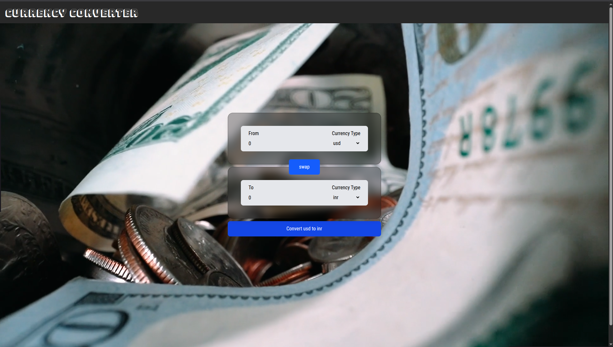

# 💱 React Currency Converter

A real-time currency conversion tool built with React. This application fetches live exchange rates to provide accurate conversions between global currencies.

> **Note:** This project was developed as a learning exercise to understand API integration and custom hooks in React.

## 🚀 Overview

This application provides a simple, intuitive interface for converting money. It features a background-aware design with a "glassmorphism" style UI, allowing users to select currencies, input amounts, and get instant results.

## ✨ Features

-   **Live Currency Data:** Fetches real-time exchange rates from an external API.
-   **Swap Functionality:** Quickly switch between "From" and "To" currencies with a single click.
-   **Dynamic Dropdowns:** Automatically populates currency options based on available API data.
-   **Responsive Design:** Optimized for a smooth experience on various screen sizes.

## 🛠️ Tech Stack

-   **Frontend:** React.js
-   **Styling:** Tailwind CSS
-   **Data Source:** Currency Exchange API (e.g., freecurrencyapi or similar)

## 📸 Interface



## 📦 Getting Started

To run the converter locally:

1.  **Clone the repository**
    ```bash
    git clone [https://github.com/abhi-afk-dev/currency_converter.git](https://github.com/abhi-afk-dev/currency_converter.git)
    ```

2.  **Navigate to the project directory**
    ```bash
    cd frontend
    ```

3.  **Install dependencies**
    ```bash
    npm install
    ```

4.  **Run the application**
    ```bash
    npm run dev
    ```

## 📄 License

This project is open source and available under the [MIT License](LICENSE).